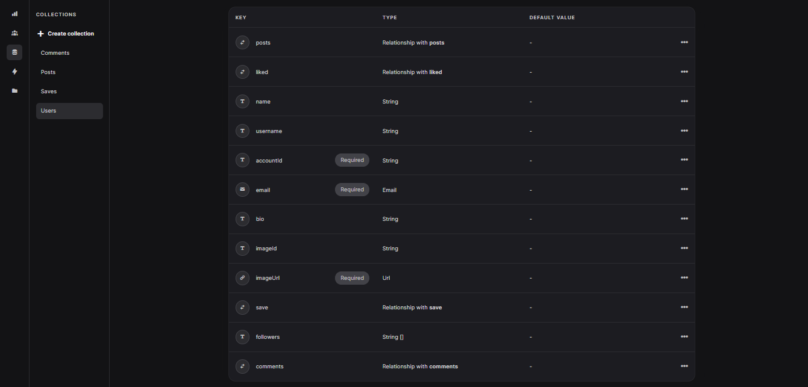
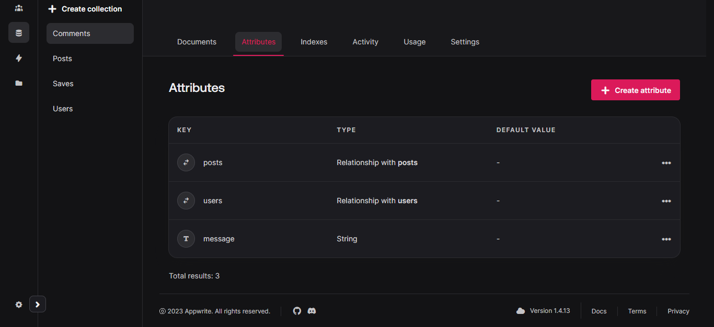
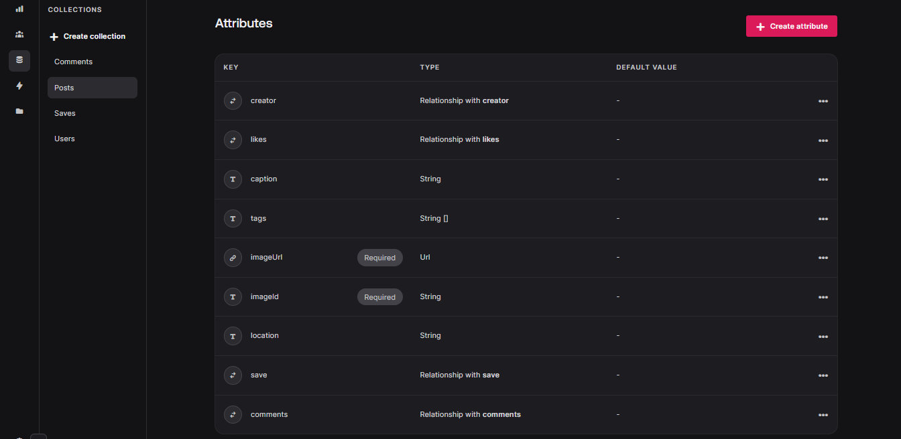
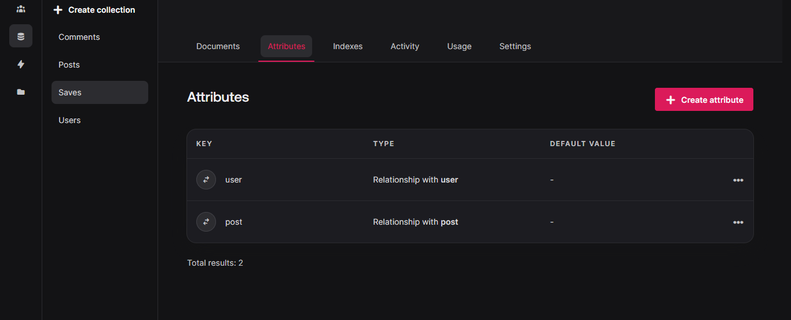

# WriteBomb - Aplicativo de Rede Social

Bem-vindo ao WriteBomb, seu novo espaço para compartilhar ideias, histórias e momentos com a comunidade! Este projeto é uma rede social interativa onde os usuários podem criar, curtir, comentar e interagir de diversas maneiras.

## Funcionalidades Principais

- **Postagens:** Crie suas próprias postagens para compartilhar com a comunidade. Edite, exclua e salve conforme necessário.

- **Interação:** Curta e comente nas postagens de outros usuários. Construa uma comunidade envolvente.

- **Perfil Personalizado:** Edite seu perfil, siga outros usuários e mantenha-se conectado.

- **Design Responsivo e Animado:** Desfrute de uma experiência de usuário suave e envolvente, inspirada na simplicidade do Instagram e na organização do Pinterest.

## Tecnologias Utilizadas

- **Vite:** Desenvolvimento rápido e eficiente.
- **TailwindCSS:** Estilo moderno e responsivo.
- **Typescript:** Código mais seguro e legível.
- **Shadcn UI:** Componentes UI elegantes e personalizáveis.
- **React Query:** Gerenciamento de estado eficiente.
- **AppWrite:** Backend simplificado para autenticação, armazenamento e muito mais.
- **React-i18next:** Internacionalização para atender a diversos públicos.
- **Framer Motion:** Animações fluidas para uma experiência visual atraente.
- **Zod:** Validador de esquemas para garantir dados consistentes.
- **Toast:** Notificações elegantes para melhorar a experiência do usuário.

## Como Contribuir

Sinta-se à vontade para contribuir para o desenvolvimento do WriteBomb! Basta seguir o link do [repositório](https://github.com/EricSousa02/WriteBomb) e fazer suas sugestões ou enviar pull requests.

## Deploy

Confira a versão ao vivo do WriteBomb [aqui](https://write-bomb.vercel.app/)!

## Como Configurar

Siga o exemplo de banco das variáveis de ambiente a seguir e de como fazer as tabelas no banco de dados.

- VITE_APPWRITE_PROJECT_ID=''
- VITE_APPWRITE_URL='https://cloud.appwrite.io/v1'
- VITE_APPWRITE_STORAGE_ID=''
- VITE_APPWRITE_DATABASE_ID=''
- VITE_APPWRITE_SAVES_COLLECTION_ID=''
- VITE_APPWRITE_POST_COLLECTION_ID=''
- VITE_APPWRITE_USER_COLLECTION_ID=''
- VITE_APPWRITE_COMMENT_COLLECTION_ID=''

## Imagens de Exemplo

   
 
